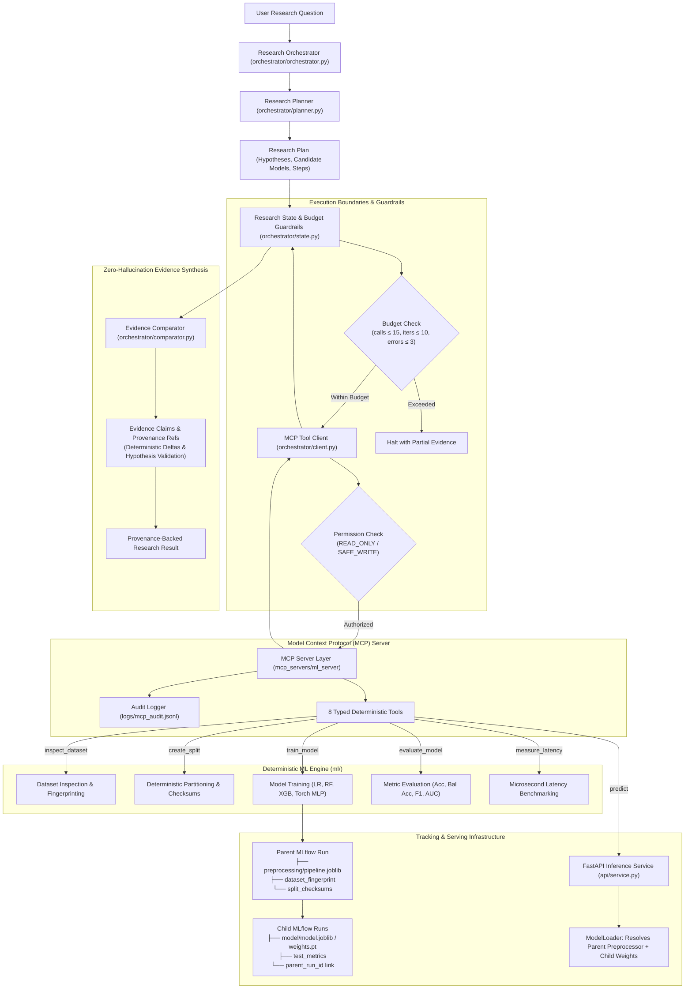

# Autonomous ML Research Lab

### Bounded, Zero-Hallucination Agentic Research Infrastructure with Deterministic ML Computation, MCP Tool Isolation, and Cryptographic Lineage Tracking

[](https://www.python.org/)
[](tests/)
[](mcp_servers/)
[](https://mlflow.org/)
[](https://fastapi.tiangolo.com/)
[](LICENSE)

Autonomous ML Research Lab is an end-to-end research infrastructure system that converts natural-language ML research questions into bounded, reproducible experiments through MCP-based tool execution, deterministic ML computation, MLflow lineage, and evidence-backed results.

The system enforces a foundational engineering principle:

> **"Agents decide what to investigate. Deterministic systems decide what the numbers are."**

```text
LLM / Agent
    ↓
Research Orchestrator
    ↓
MCP Tool Layer
    ↓
Deterministic ML Engine
    ↓
MLflow / FastAPI / Evidence
    ↓
Provenance-backed Research Result
```

---

## Why This Exists

Autonomous and agentic workflows in machine learning present severe engineering failure modes when implemented as unstructured chatbots or monolithic Python scripts:

1. **Hallucinated Empirical Results**: LLMs tasked with running or summarizing benchmarks frequently fabricate metrics, miscalculate percentage improvements, or alter evaluation thresholds. In scientific research and quantitative technology, hallucinated numbers invalidate empirical claims.
2. **Experiment Irreproducibility**: Ad-hoc notebook experiments suffer from silent data leakage (e.g., fitting scalers across the full dataset prior to splitting), inconsistent seeds, and untracked environment mutations.
3. **Missing Model Provenance**: Comparing model performance without tracking the exact dataset hash, partition checksums, and configuration signatures makes it impossible to verify if two candidate models were evaluated on the identical data distribution.
4. **Lineage Skew in Production Serving**: Inference services often re-implement feature preprocessing or decouple model weights from the training-time pipeline, leading to silent production distribution skew.
5. **Runaway Agent Loops & Arbitrary Execution**: Unconstrained autonomous agents given open shell access can fall into infinite retry loops, run unvetted scripts (`eval()` / `exec()`), or consume unlimited computational budgets.

**How Autonomous ML Research Lab solves these problems:**
- **Zero-Hallucination Evidence Contract**: The agent orchestrator never computes metrics. All numerical figures, confusion matrices, and latency percentiles are produced exclusively by deterministic Python functions and returned over structured Model Context Protocol (MCP) boundaries. Every claim in the final research result is cryptographically linked to a verified `ToolCallRecord` and MLflow run ID.
- **Strict Leak-Free Pipeline**: Preprocessing transformers (imputation, scaling, encoding) are fit strictly on training partitions and validated with SHA-256 partition checksums.
- **Parent/Child MLflow Lineage**: An experiment-level parent run holds the persisted preprocessing artifact and dataset fingerprint, while nested child runs hold model weights and link back to the parent.
- **Lineage-Aware Serving**: The FastAPI inference service resolves the parent run ID from the child model artifact to load the exact persisted training transformer, guaranteeing mathematical prediction equivalence ($10^{-5}$ tolerance) between training and production.
- **Bounded Guardrails**: Hard limits on tool calls, iterations, failure cascades, and wall-clock execution time prevent runaway execution.

---

## Architecture



---

## Completed Phases

The repository currently implements **Phases 1 through 5**. All subsequent phases (Phases 6–10) are future roadmap components.

| Phase | Component | Status | Description |
| :--- | :--- | :--- | :--- |
| **Phase 1** | **Deterministic ML Research Engine** | **Completed** | Standalone ML computation engine supporting dataset profiling, SHA-256 fingerprinting, deterministic stratified splitting, leak-free preprocessing transformers, 4 model families (Logistic Regression, Random Forest, XGBoost, PyTorch MLP), comprehensive classification metrics, and nanosecond-resolution latency benchmarking across batch sizes. Completely decoupled from LLMs and tracking tools. |
| **Phase 2** | **MLflow Experiment Tracking & Lineage** | **Completed** | Pure-observer MLflow tracker adapter establishing an experiment-level Parent Run (persisting the shared preprocessing transformer, dataset fingerprint, and split hashes) and nested Child Runs (persisting model weights and metrics). Features canonical SHA-256 configuration hashing, Git commit tracking, and full `--no-tracking` offline support. |
| **Phase 3** | **Production Model Serving & Inference Service** | **Completed** | Production FastAPI serving layer (`api/`) decoupled from training code. `ModelLoader` dynamically resolves the parent run ID to reconstruct the exact training-time preprocessor, guaranteeing mathematical prediction equivalence to Phase 1 training. Features strict Pydantic payload validation and server-side latency profiling. |
| **Phase 4** | **Model Context Protocol (MCP) Server Layer** | **Completed** | Standardized MCP server exposing 8 typed tools over local `stdio` using the official Python MCP SDK. Implements a three-tier permission model (`READ_ONLY`, `SAFE_WRITE`, `HIGH_RISK`), path traversal defenses, input sanitization, structured error hierarchy (`MCPToolError`), and persistent JSONL audit logging with automated credential redaction. |
| **Phase 5** | **Agentic Research Orchestration** | **Completed** | Bounded research orchestrator translating natural-language research questions into structured hypotheses and execution plans. Interacts with the ML engine strictly through the MCP tool client. Enforces runtime execution budgets, collects verified tool records, and executes a deterministic evidence comparator to synthesize zero-hallucination research conclusions. |

---

## Agentic Research Workflow

In Phase 5, the orchestrator acts as a bounded, deterministic scientific investigator. It does **not** rely on opaque, non-deterministic agent loops or multi-agent debate frameworks.

### Example Research Execution Flow

Consider the research inquiry:
> *"Compare logistic regression and random forest on the breast cancer dataset and determine which model has better balanced accuracy while also considering inference latency."*

```text
User Question
      │
      ▼
1. ResearchPlanner.plan(question)
      │  • Formulates Hypothesis H1: "random_forest achieves higher balanced_accuracy than logistic_regression"
      │  • Formulates Hypothesis H2: "logistic_regression achieves lower p95_latency_ms than random_forest"
      │  • Constructs 6 sequenced ExperimentSteps
      ▼
2. Tool Execution via MCPToolClient (mcp_server.call_tool)
      │  Step 1: inspect_dataset(dataset_name="breast_cancer")
      │          └── Verifies 569 samples, 30 features, SHA-256 fingerprint
      │  Step 2: create_split(dataset_name="breast_cancer", split_strategy="stratified", test_size=0.2)
      │          └── Computes partition checksums (train: 455, test: 114)
      │  Step 3: train_model(model_name="logistic_regression", C=0.5, ...)
      │          └── Fits estimator, logs MLflow child run c189b88..., returns metrics
      │  Step 4: train_model(model_name="random_forest", n_estimators=100, ...)
      │          └── Fits estimator, logs MLflow child run 16565a1..., returns metrics
      │  Step 5: measure_inference_latency(model_name="logistic_regression", batch_sizes=[1])
      │          └── Benchmarks 200 iterations with 25 warmups
      │  Step 6: measure_inference_latency(model_name="random_forest", batch_sizes=[1])
      │          └── Benchmarks 200 iterations with 25 warmups
      ▼
3. Evidence Extraction & State Recording
      │  • Records each completed step into a validated ToolCallRecord
      │  • Enforces budget constraints (calls used: 6/15, errors: 0/3)
      ▼
4. Deterministic Comparison (EvidenceComparator)
      │  • Computes exact numerical deltas: Delta = RF - LR
      │  • Evaluates hypothesis truth values deterministically
      ▼
5. ResearchResult Generation
      └── Provenance-backed JSON object containing claims, deltas, and audit trail
```

---

## Zero-Hallucination Evidence Architecture

A core architectural invariant of this project is that **reasoning models are forbidden from calculating or inventing numerical values**.

### How Provenance is Guaranteed

```text
Numerical Metric Needed
        │
        ├─► Was metric produced by an executed MCP ToolCallRecord?
        │         │
        │         ├── YES ──► Extract exact float from ToolCallRecord output
        │         │           Attach ProvenanceRef:
        │         │             • source_tool_call_id (UUID)
        │         │             • entity_id (MLflow run ID)
        │         │             • property_path ("metrics.balanced_accuracy")
        │         │
        │         └── NO  ──► Mark metric as "UNAVAILABLE"
        │                     Do NOT ask LLM to estimate or guess
        ▼
EvidenceComparator
        │
        ├── Computes Delta = Candidate_A - Candidate_B using Python arithmetic
        └── Evaluates Hypotheses (SUPPORTED / NOT_SUPPORTED / INCONCLUSIVE)
```

### Traceability Example

Every numerical claim in the research conclusion links directly to an audited tool call:

```json
{
  "metric_name": "balanced_accuracy",
  "model_a": "logistic_regression",
  "model_a_value": 0.9701,
  "model_b": "random_forest",
  "model_b_value": 0.9474,
  "delta": -0.0227,
  "superior_model": "logistic_regression",
  "provenance": {
    "model_a_evidence": {
      "tool_call_id": "8b7c81f2-51e9-4e5a-b9c1-7a6e11894d01",
      "entity_id": "c189b88e1a7b441ca09a9094719b02cf",
      "property_path": "metrics.balanced_accuracy",
      "timestamp": "2026-09-19T17:32:51.104Z"
    },
    "model_b_evidence": {
      "tool_call_id": "f45a709d-0912-4bf1-831e-450a80e1b123",
      "entity_id": "16565a1f51834879bfce49cbf1e556c3",
      "property_path": "metrics.balanced_accuracy",
      "timestamp": "2026-09-19T17:33:14.882Z"
    }
  }
}
```

If an experiment step fails or a metric is omitted from the tool output, the system records the metric as `UNAVAILABLE` and flags the hypothesis as `INCONCLUSIVE` rather than allowing the agent to fill the gap with synthetic estimates.

---

## Safety and Guardrails

The execution boundary between the orchestrator and the local system enforces strict defense-in-depth:

### 1. Three-Tier Permission Matrix
- **`READ_ONLY`**: Non-mutating inspection tools (`inspect_dataset`, `evaluate_model`, `measure_inference_latency`, `get_experiment_result`, `get_model_lineage`, `predict`). Available to all caller tiers.
- **`SAFE_WRITE`**: Deterministic mutations confined to temporary workspaces and tracking stores (`create_split`, `train_model`). Allowed for authorized orchestrator runs.
- **`HIGH_RISK`**: System modification, arbitrary code execution, file deletion. **Zero HIGH_RISK tools are exposed in the MCP server.**

### 2. Execution Boundaries
- **No `eval()` / `exec()`**: All execution flows through pre-compiled, statically defined Python classes.
- **No Arbitrary Shell / Subprocess Execution**: The MCP layer does not provide bash or shell access.
- **Path Traversal Defenses**: All file targets are sanitized and restricted to authorized project subdirectories; attempts to access parent paths (`../`) or absolute root directories are rejected.
- **Strict Schema Validation**: All tool arguments and API payloads are validated against Pydantic schemas; invalid types, extra attributes, and `NaN`/`Inf` floating-point values are rejected before execution.

### 3. Execution Budgets (Runaway Prevention)
The orchestrator operates under an immutable `BudgetConfig` enforced on every iteration:
- **`max_tool_calls = 15`**: Maximum total tool invocations permitted per research run.
- **`max_iterations = 10`**: Maximum planning/refinement iterations.
- **`max_failed_tool_calls = 3`**: Maximum sequential tool failures before halting.
- **`timeout_seconds = 300.0`**: Wall-clock execution timeout.

### 4. Audit Logging
Every tool invocation through MCP is persisted to `logs/mcp_audit.jsonl` with timestamps, permission tier, execution duration, sanitized inputs, and status. Sensitive configuration patterns (API keys, secrets, tokens) are automatically redacted before disk writing.

---

## Tech Stack

All dependencies are pinned, production-grade libraries:

- **Language & Runtime**: Python (>= 3.11)
- **Machine Learning**: scikit-learn, XGBoost, PyTorch, SciPy, NumPy, pandas
- **Experiment Tracking**: MLflow
- **Model Serving**: FastAPI, Uvicorn, Starlette
- **Data Modeling & Validation**: Pydantic (v2)
- **Protocol Boundary**: MCP Python SDK (Model Context Protocol) over `stdio`
- **Testing & Verification**: pytest, pytest-asyncio, HTTPX
- **Configuration & Logging**: PyYAML, structlog, Git

---

## Verification

The system includes a verified automated test suite covering all architectural layers:

```text
================= 96 passed, 4 warnings in 158.17s =================
```

### Verified Test Categories

| Test Category | Scope & Invariants Tested | Passing Tests |
| :--- | :--- | :---: |
| **Deterministic ML Engine** | Dataset fingerprinting, stratified splitting, leak-free preprocessing, model lifecycle (LR, RF, XGB, Torch MLP), batch-1 safety, seed reproducibility. | 25 |
| **Metrics & Latency** | Precision, recall, balanced accuracy, F1, ROC-AUC, PR-AUC, confusion matrices, microsecond latency percentiles across batch sizes. | 5 |
| **MLflow Tracking & Lineage** | Parent/child run creation, preprocessing artifact ownership, cryptographic lineage inheritance, `--no-tracking` isolation. | 4 |
| **Model Serving API** | FastAPI health endpoints, strict Pydantic payload validation, NaN/Inf rejection, missing/extra feature rejection, 503 unloaded safety, **direct-vs-API mathematical equivalence proof**. | 11 |
| **MCP Integration & Schema** | Input/output schema validation, tool registration, JSON-safe data transfer across stdio transport. | 14 |
| **MCP Permissions & Security** | Three-tier permission registry, rejection of unauthorized callers, path traversal defenses, confirmation that zero HIGH_RISK tools are exposed. | 5 |
| **MCP Audit Logging** | JSONL audit trails, execution duration recording, automated credential/token redaction. | 4 |
| **Orchestrator Planning & State**| Hypothesis formulation, sequenced step planning, fallback single-model parsing, `ResearchState` transitions, tool-call tracking, budget exhaustion guards. | 12 |
| **Comparator & Provenance** | Zero-hallucination extraction, refusal to invent missing metrics (`UNAVAILABLE`), deterministic delta computation, hypothesis evaluation. | 4 |
| **End-to-End Orchestration** | Complete natural-language research loop resolving candidate models via MCP with zero hallucinated metrics, verified budget halts, protocol routing verification. | 12 |
| **Total Verified Test Suite** | **Comprehensive end-to-end multi-phase verification** | **96 passed** |

---

## Example Result

The following verified research output was generated end-to-end by the Phase 5 `ResearchOrchestrator` in response to the user research question:

> *"Compare logistic regression and random forest on the breast cancer dataset and determine which model has better balanced accuracy while also considering inference latency."*

### Empirical Evidence Summary

| Candidate Model | Balanced Accuracy | Test Accuracy | Test F1 Score | Test ROC-AUC | p95 Latency (b=1) | Provenance (MLflow Child Run) |
| :--- | :---: | :---: | :---: | :---: | :---: | :--- |
| **Logistic Regression** | **0.9701** | 0.9737 | 0.9793 | 0.9947 | **0.450 ms** | `c189b88e1a7b441ca09a9094719b02cf` |
| **Random Forest** | **0.9474** | 0.9474 | 0.9583 | 0.9921 | **13.022 ms** | `16565a1f51834879bfce49cbf1e556c3` |

### Deterministic Comparison Deltas ($\Delta = \text{Random Forest} - \text{Logistic Regression}$)

- **Balanced Accuracy Delta**: `-0.0227` (On this specific test partition, Logistic Regression scored 0.9701 vs. Random Forest's 0.9474)
- **p95 Latency Delta**: `+12.572 ms` (In local single-thread CPU benchmarking at batch size 1, Logistic Regression recorded 0.450 ms vs. Random Forest's 13.022 ms)

### Hypothesis Outcomes
- **Hypothesis 1** (*"random_forest achieves higher balanced_accuracy than logistic_regression"*): **NOT SUPPORTED** on this test partition under default hyperparameters.
- **Hypothesis 2** (*"logistic_regression achieves lower p95_latency_ms than random_forest"*): **SUPPORTED** on this single-thread CPU benchmark at batch size 1.

All numbers and deltas were computed deterministically by Python functions; zero quantitative values were estimated or generated by an LLM.

### Empirical Scope & Methodological Boundaries

To ensure scientific rigor, these findings are explicitly bounded by the experimental protocol:
1. **Dataset Specificity**: Evaluated exclusively on the UCI Breast Cancer Wisconsin (Diagnostic) tabular dataset (569 rows, 30 continuous features, binary classification). These metrics cannot be generalized to other domains, dataset sizes, or class distributions.
2. **Single-Seed Partitioning**: Results reflect a single stratified partition (seed 42, 80/10/10 split). The reported deltas describe observed differences on this partition; multi-seed variance and statistical significance tests ($p$-values) were not computed.
3. **Baseline Hyperparameters**: Estimators were evaluated with default baseline hyperparameters. Systematic hyperparameter tuning (e.g. tree depth tuning, regularizer sweeps) was not performed.
4. **Hardware-Specific Latency**: Latency benchmarks reflect local CPU single-process measurements with 25 warmup iterations and 100 timed iterations. Real-world serving latency will vary across different CPU architectures, memory bandwidths, and concurrent load levels.

---

## Repository Structure

```text
auto_research_lab/
├── ml/                          # Deterministic ML Research Engine (Phase 1 & 2)
│   ├── datasets/                # Loaders, data profilers, and SHA-256 fingerprinting
│   ├── splitters/               # Deterministic stratified and random splitters
│   ├── preprocessing/           # Leak-free scikit-learn transformers
│   ├── models/                  # Wrappers for Sklearn, XGBoost, and PyTorch MLP
│   ├── evaluation/              # Metrics calculation and microsecond latency profilers
│   ├── tracking/                # MLflow observer adapter (Parent/Child run lineage)
│   ├── config.py                # Pydantic schemas with canonical config hashing
│   ├── runner.py                # Standalone deterministic runner & ExperimentExecution container
│   └── cli.py                   # Command-line interface with tracking controls
├── api/                         # Production Model Serving & Inference Service (Phase 3)
│   ├── schemas.py               # Strict Pydantic input/output schemas
│   ├── loader.py                # ModelLoader resolving parent/child MLflow artifacts
│   ├── service.py               # InferenceService & latency timer
│   └── server.py                # FastAPI HTTP application and endpoint routes
├── mcp_servers/                 # Model Context Protocol (MCP) Boundary (Phase 4)
│   ├── common/                  # Permission tiers, audit logger, errors, schemas
│   ├── ml_server/               # ML MCP server exposing 8 deterministic tools over stdio
│   └── research_server/         # Research orchestration tool interfaces
├── orchestrator/                # Agentic Research Orchestrator (Phase 5)
│   ├── state.py                 # Typed ResearchState, ToolCallRecord, BudgetConfig
│   ├── schemas.py               # ResearchPlan, Hypothesis, EvidenceClaim, ResearchResult
│   ├── client.py                # MCPToolClient interfacing with MCPServer via protocol
│   ├── planner.py               # Research question parser and structured plan generator
│   ├── comparator.py            # Deterministic evidence comparator & zero-hallucination verifier
│   └── orchestrator.py          # ResearchOrchestrator coordinating autonomous lifecycle
├── configs/                     # Canonical experiment and serving configurations
│   ├── example_experiment.yaml  # Multi-model tabular benchmark configuration
│   └── serving_config.yaml      # Model serving deployment configuration
├── docs/                        # Deep architectural documentation
│   ├── architecture.md          # Comprehensive component diagrams and dataflow specifications
│   └── design-decisions.md      # Engineering trade-offs, boundary rationale, and invariants
└── tests/                       # Complete automated test suite (96 tests)
    ├── unit/                    # Unit tests for ML engine, schemas, permissions, audit, orchestrator
    └── integration/             # End-to-end pipeline, lineage, API serving, MCP, and agent tests
```

---

## Getting Started

### 1. Clone the Repository
```bash
git clone https://github.com/mannatgoyal/auto_research_lab.git
cd auto_research_lab
```

### 2. Create and Activate a Virtual Environment
```bash
# Linux / macOS:
python3 -m venv .venv
source .venv/bin/activate

# Windows:
python -m venv .venv
.\.venv\Scripts\activate
```

### 3. Install Dependencies
```bash
pip install --upgrade pip
pip install -e ".[dev]"
```

### 4. Run the Verified Test Suite
Run all 96 unit and integration tests:
```bash
pytest -v
```

### 5. Run the Deterministic ML Engine via CLI
Execute a multi-model benchmark experiment with tracking disabled:
```bash
python -m ml.cli --config configs/example_experiment.yaml --no-tracking
```

Or execute with local MLflow tracking enabled:
```bash
python -m ml.cli --config configs/example_experiment.yaml --tracking-uri sqlite:///mlflow.db --experiment-name tabular_benchmark
```

To launch the MLflow UI and inspect parent/child runs and cryptographic hashes:
```bash
mlflow ui --backend-store-uri sqlite:///mlflow.db
```

### 6. Run the Model Serving API
Start the FastAPI prediction service:
```bash
python -m api.server --config configs/serving_config.yaml
```
Interactive API documentation will be available at `http://127.0.0.1:8000/docs`.

### 7. Run the MCP Tool Server
Launch the Model Context Protocol server over `stdio`:
```bash
python -m mcp_servers.ml_server.server
```

### 8. Run an Agentic Research Orchestration Query
Execute a research question programmatically through the bounded orchestrator:
```python
import asyncio
from orchestrator import ResearchOrchestrator

async def run_study():
    orchestrator = ResearchOrchestrator()
    question = (
        "Compare logistic regression and random forest on the breast cancer dataset "
        "and determine which model has better balanced accuracy while also considering inference latency."
    )
    result = await orchestrator.run(question)
    
    print(f"Status: {result.status}")
    print(f"Conclusion:\n{result.conclusion}")
    for comparison in result.comparisons:
        print(f"[{comparison.metric_name}] Winner: {comparison.superior_model}, Delta: {comparison.delta}")

if __name__ == "__main__":
    asyncio.run(run_study())
```

---

## Current Limitations

This release intentionally covers **Phases 1 through 5**. The following capabilities are explicitly outside the current scope:

- **Single-Seed Point Estimates**: The current orchestrator evaluates candidates across a single deterministic split per run. Cross-validation loops, multi-seed variance bounds, and paired statistical significance tests ($p$-values) are roadmap components for Phase 10.
- **Targeted Comparative Inquiries**: Natural-language planning uses structured heuristics and deterministic state transitions. While this guarantees bounded execution and zero runaway loops, it is currently designed for comparative empirical evaluations rather than open-ended literature discovery.
- **No Multi-Agent Debate or Specialized Subagents**: The current orchestrator is a bounded, single-orchestrator state machine. Specialized autonomous roles (e.g., dedicated Critic Agent, Literature Search Agent, or Report Synthesis Agent) belong to Phase 6+.
- **Local Tool Transport**: MCP communication operates over local `stdio`. Distributed or remote SSE (Server-Sent Events) network transports are not yet implemented.
- **Tabular Focus**: Preprocessing and candidate model architectures are currently optimized for tabular classification datasets. Computer vision and natural language fine-tuning pipelines are planned for future phases.
- **Single-Node Execution**: Experiment execution and latency benchmarking run on a single machine (CPU or local GPU). Distributed cluster training (e.g., Ray or Slurm) is not yet supported.

---

## Roadmap

```text
[✓] Phase 1: Deterministic ML Research Engine
[✓] Phase 2: MLflow Experiment Tracking & Cryptographic Lineage
[✓] Phase 3: Production Model Serving & Inference Service
[✓] Phase 4: Model Context Protocol (MCP) Server Layer
[✓] Phase 5: Agentic Research Orchestration
─────────────────────────────────────────────────────────────────────────────
[ ] Phase 6: Multi-Agent Roles (Planner, Critic, Literature Reviewer, Synthesizer)
[ ] Phase 7: Observability & OpenTelemetry Tracing
[ ] Phase 8: Containerized Sandboxing & Remote Execution
[ ] Phase 9: Automated LaTeX / PDF Paper Generation
[ ] Phase 10: Quantitative Benchmark Evaluation & Self-Improving Research Loops
```

---

## License

This project is licensed under the MIT License - see the [LICENSE](LICENSE) file for details.
