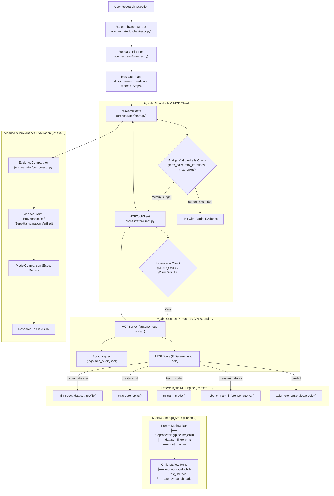

# Autonomous ML Research Lab: System Architecture

The **Autonomous ML Research Lab** is an end-to-end research infrastructure system that translates natural-language machine learning research questions into bounded, reproducible experiments through Model Context Protocol (MCP) tool execution, deterministic ML computation, MLflow lineage tracking, and zero-hallucination evidence evaluation.

---

## 1. Architectural Overview



---

## 2. Core Architectural Separation

The fundamental design principle across the entire system is:

> **"Agents decide what to investigate. Deterministic systems decide what the numbers are."**

```text
Orchestrator / Agent ──► MCP Tool Interface ──► Deterministic Python Functions
        ▲                                                      │
        │                                                      ▼
        └────────────────── Verified Tool Evidence ────────────┘
```

1. **Reasoning Layer (`orchestrator/`)**:
   - Dissects natural-language research questions.
   - Formulates testable hypotheses and sequenced experiment steps.
   - Dispatches tool invocations strictly through MCP.
   - Never calculates metrics or executes raw Python code.
2. **Interface Boundary (`mcp_servers/`)**:
   - Implements the Model Context Protocol (MCP) using the official Python SDK over `stdio`.
   - Enforces a three-tier permission model (`READ_ONLY`, `SAFE_WRITE`, `HIGH_RISK`).
   - Validates all arguments with strict Pydantic schemas.
   - Produces structured JSON-safe outputs and audit records (`logs/mcp_audit.jsonl`).
3. **Deterministic ML Engine (`ml/`)**:
   - Independent of LLMs and tracking tools.
   - Deterministic dataset profiling, SHA-256 fingerprinting, and leak-free splitting.
   - Native support for Logistic Regression, Random Forest, XGBoost, and PyTorch MLP.
   - High-precision microsecond inference latency profiling across batch sizes.
4. **Tracking & Lineage Store (`ml/tracking/`)**:
   - Observes deterministic engine outputs without altering computation.
   - Preserves parent-level preprocessing artifacts and child-level model weights.
   - Records cryptographic SHA-256 hashes for datasets, configs, and partitions.
5. **Production Model Serving (`api/`)**:
   - Production FastAPI service decoupled from training loops.
   - Restores persisted training transformers, guaranteeing mathematical prediction equivalence to Phase 1 training.

---

## 3. Tool Catalog and Permissions

| Tool Name | Permission Tier | Delegated Engine Target | Output Contract |
| :--- | :--- | :--- | :--- |
| **`inspect_dataset`** | `READ_ONLY` | `ml.inspect_dataset_profile()` | Row count, column count, feature statistics, imbalance ratio, correlation pairs, SHA-256 fingerprint. |
| **`create_split`** | `SAFE_WRITE` | `ml.create_splits()` | Partition row counts (`train_rows`, `val_rows`, `test_rows`) and partition checksums (`train_sha256`, `test_sha256`). |
| **`train_model`** | `SAFE_WRITE` | `ml.train_model()` | Trains candidate model, logs MLflow parent/child runs, returns test metrics and latency benchmarks. |
| **`evaluate_model`** | `READ_ONLY` | `ml.evaluate_predictions()` | Evaluates accuracy, balanced accuracy, precision, recall, F1, ROC-AUC, PR-AUC, and confusion matrix. |
| **`measure_inference_latency`** | `READ_ONLY` | `ml.benchmark_inference_latency()` | Microsecond p50, p90, p95, p99 latency percentiles and throughput across batch sizes on a loaded model. |
| **`get_experiment_result`** | `READ_ONLY` | Disk / MLflow reader | Complete machine-readable `ExperimentResult` JSON evidence and configuration hashes. |
| **`get_model_lineage`** | `READ_ONLY` | `MlflowClient` query | Traces child model run to parent run ID, configuration hash, dataset fingerprint, and Git commit. |
| **`predict`** | `READ_ONLY` | `api.InferenceService.predict()` | Transforms raw feature payload via training transformer and returns class prediction and probabilities. |

---

## 4. Production Serving Flow (Phase 3)

```text
HTTP Client
    │
    │  POST /predict (JSON payload: {"features": {...}})
    ▼
FastAPI Server (api/server.py)
    │
    ▼
Pydantic Input Validation (api/schemas.py)
    │  (Rejects missing features, extra features, NaNs, infinities)
    ▼
InferenceService (api/service.py)
    │
    ▼
ModelLoader (api/loader.py)
    ├── Reads child run from MLflow (resolves model weights)
    └── Resolves parent_run_id (loads exact training preprocessor)
    │
    ▼
InferencePipeline
    ├── Step 1: Preprocessor.transform(raw_features)
    └── Step 2: Model.predict_proba(transformed_features)
    │
    ▼
HTTP Response (predicted_class, predicted_label, probabilities, latency_ms)
```
