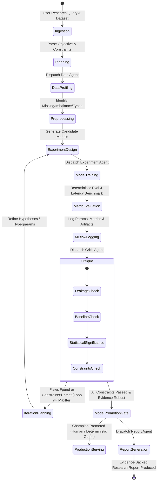

# Autonomous ML Research Lab: System Design & Architecture Specification

## Project Overview

The **Autonomous ML Research Lab** is an end-to-end multi-agent system designed for automated, reproducible, and verifiable machine learning research. It takes natural language empirical research questions (e.g., *"Compare XGBoost and an MLP on this dataset. Optimize for F1 score while maintaining p95 inference latency under 20ms. Investigate the failure modes of the weaker model"*), translates them into structured hypothesis graphs and experiment pipelines, invokes deterministic execution tools via the **Model Context Protocol (MCP)**, tracks lineage in **MLflow**, subjects candidate models to adversarial critique, registers champions against strict deterministic criteria, serves the winner via a low-latency **FastAPI** service, and compiles evidence-backed research reports where every metric is cryptographically tied to a tracked run ID.

---

## User Review Required

> [!IMPORTANT]
> **Zero-Hallucination Policy**: LLM agents *never* execute computations or invent numerical metrics. All data transformations, metrics calculations, latency microbenchmarks, and statistical significance tests are executed by isolated, deterministic Python engines and exposed via MCP tools. The LLM only interprets validated artifacts.

> [!IMPORTANT]
> **Strict Tool Permission Tiers**: Tools are compartmentalized into `READ_ONLY`, `SAFE_WRITE`, and `HIGH_RISK`. High-risk operations (such as deploying a model to production serving, archiving an existing champion, or modifying dataset splits) require explicit human cryptographic or token approval.

---

## A. Proposed System Architecture

### 1. High-Level Architectural Topology

```
                                  +---------------------------------------+
                                  |              User Interface           |
                                  |     (CLI / API / Research Console)    |
                                  +-------------------+-------------------+
                                                      |
                                                      v
                                  +---------------------------------------+
                                  |     Research Orchestrator Engine      |
                                  |     - Research State Graph & Context  |
                                  |     - Hypothesis Tree Management      |
                                  |     - Budget & Termination Controller |
                                  +-------------------+-------------------+
                                                      |
                    +---------------------------------+---------------------------------+
                    |                                 |                                 |
                    v                                 v                                 v
        +-----------------------+         +-----------------------+         +-----------------------+
        |      Data Agent       |         | Model Experiment Agent|         |  Critic/Eval Agent    |
        | - EDA & Quality Audit |         | - Model Architecture  |         | - Data Leakage Audits |
        | - Leak-Free Splits    |         | - Training & Sweeps   |         | - Overfitting Audits  |
        | - Preprocessing Pipe  |         | - Latency Profiler    |         | - Statistical Tests   |
        +-----------+-----------+         +-----------+-----------+         +-----------+-----------+
                    |                                 |                                 |
                    +---------------------------------+---------------------------------+
                                                      |
                                                      v
                                  +---------------------------------------+
                                  |          MCP Client Gateway           |
                                  |   (Transport: stdio / JSON-RPC 2.0)   |
                                  |   - Permission Policy Engine          |
                                  |   - Schema Validator (Pydantic)       |
                                  |   - Audit Logger & Metrics Hook       |
                                  +-------------------+-------------------+
                                                      |
                            +-------------------------+-------------------------+
                            |                                                   |
                            v                                                   v
        +---------------------------------------+           +---------------------------------------+
        |          MCP Server 1: ML             |           |       MCP Server 2: Research          |
        |  - Dataset Inspection & Profiling     |           |  - ArXiv / Semantic Scholar Search    |
        |  - Preprocessing & Splitting Engine   |           |  - Literature Methodology Extraction  |
        |  - Deterministic Train/Eval Harness   |           |  - Baseline Retrieval Engine          |
        |  - Microsecond Latency Profiler       |           +---------------------------------------+
        |  - Model Registry & Checkpointer      |
        +-------------------+-------------------+
                            |
           +----------------+----------------+
           |                                 |
           v                                 v
+-----------------------+         +-----------------------+         +-----------------------+
|    MLflow Tracking    |         |  SQLite / PostgreSQL  |         |   FastAPI Serving     |
| - Runs, Params, Seed  |         | - Agent Task States   |         | - Champion Inference  |
| - p50/p95/p99 Latency |         | - Tool Execution Logs |         | - Schema Validation   |
| - Model Artifacts     |         | - Audit Trails        |         | - Latency Middleware  |
+-----------------------+         +-----------------------+         +-----------+-----------+
                                                                                |
                                                                                v
                                                                    +-----------------------+
                                                                    | Prometheus Monitoring |
                                                                    | - Latency Histograms  |
                                                                    | - Drift Detection     |
                                                                    +-----------------------+
```

### 2. State Transition & Control Loop

The system operates as a finite state machine (FSM) over a typed `ResearchContext`:



### 3. State Management & Zero-Hallucination Data Flow

1. **State Isolation**: Agents communicate exclusively through an append-only `ResearchContext` state object stored in SQLite. No agent directly mutates another agent's memory.
2. **Deterministic Payload Hashing**: Every data split, preprocessor artifact, and model weight file generates a SHA-256 hash. The hash is recorded in MLflow run tags and stored in SQLite.
3. **Fact-Checking Gate (Anti-Hallucination)**: When the `Report Agent` or `Critic Agent` outputs assertions (e.g. "Model A achieved an F1 of 0.871"), an automated verification hook parses the claim against the MLflow database. If the exact value cannot be matched to a registered run UUID within $\epsilon = 10^{-4}$, the response is rejected and regenerated.

---

## B. Component Responsibilities

### 1. Research Orchestrator Agent
- **Objective Decomposition**: Parses natural language requests into typed constraints: optimization target (e.g., `macro_f1`), budget constraint (`max_latency_ms <= 20`), iteration budget (`max_experiments = 6`).
- **Hypothesis Graph**: Maintains an explicit tree of hypotheses (e.g., $H_1$: "Nonlinear feature combinations will allow MLP to outperform XGBoost"; $H_2$: "Quantization will reduce MLP latency below 10ms without dropping F1 by > 0.02").
- **Workflow Scheduling & Termination**: Implements early-stopping policies (e.g., stop when metric plateaus, stop if latency constraint is strictly mathematically impossible given parameter count).

### 2. Data Agent
- **EDA & Structural Inspection**: Computes exact column types, missingness percentages, cardinality, kurtosis/skewness, target class balance, and correlation matrices.
- **Leak-Free Partitioning**: Implements strict train/val/test splits (stratified for imbalanced targets; time-series blocked/purged for temporal datasets) ensuring preprocessors fit *only* on training splits.
- **Preprocessing Pipeline**: Builds deterministic scikit-learn transformation pipelines (imputation, scaling, target-encoding, one-hot encoding) and packages them as portable serializable objects (`pipeline.joblib`).

### 3. Model Experiment Agent
- **Harness Execution**: Configures and trains models (e.g., Logistic Regression baseline, Random Forest, XGBoost/LightGBM, PyTorch Tabular MLP / ResNet).
- **Evaluation Engine**: Computes exact confusion matrices, ROC-AUC, PR-AUC, accuracy, per-class F1, and log-loss.
- **Inference Latency Profiler**: Measures single-item and batch inference speeds under identical conditions (warm-up runs, synchronized CUDA/CPU timers, p50, p90, p95, p99 microbenchmarks).
- **Lineage Logging**: Logs complete configurations, seeds, Git commit SHA, environment snapshot, and serialized weights to MLflow.

### 4. Critic / Evaluation Agent
- **Methodological Audit**: Scrutinizes experiments for:
  - Data leakage (e.g. features correlated > 0.999 with target, target leaking through identifiers).
  - Uncontrolled variables (e.g., comparing XGBoost trained on 10,000 rows with an MLP trained on 1,000 rows).
  - Latency invalidity (e.g., latency measured on batch size 1000 when API SLA specifies batch size 1).
- **Statistical Rigor**: Computes bootstrap confidence intervals (e.g., 95% CI on test F1 via 1,000 bootstrap resamples) and McNemar's test or paired t-tests before concluding one model dominates another.

### 5. Report Agent
- **Synthesizer**: Consumes MLflow runs, Critic findings, and Orchestrator hypothesis outcomes.
- **Structured Report Compilation**: Emits clean GitHub-flavored Markdown or LaTeX papers featuring executive summaries, methodology tables, Pareto frontier charts (F1 vs. Latency), error analysis, and reproducibility appendices. Every claim cites a concrete `run_id`.

### 6. MCP Servers
- **`ml_server`**: A standalone MCP server implementing tool definitions for data exploration, pipeline fitting, model training, deterministic metric extraction, latency benchmarking, and MLflow artifact retrieval.
- **`research_server`**: An MCP server providing literature retrieval (via ArXiv API or cached scholarly index), extracting baseline architectures, recommended hyperparameters, and known pitfalls for the target domain.

### 7. Storage, Serving & Observability
- **Storage**: SQLite/PostgreSQL for agent memory, task graphs, human-in-the-loop approvals, and audit trails; MLflow Tracking Server for artifacts and metrics.
- **Model Serving**: FastAPI microservice reading the latest approved `Champion` model from the MLflow Model Registry, providing `/predict`, `/health`, and `/v1/models/current` endpoints.
- **Observability**: Prometheus metrics middleware tracking p50/p95/p99 request latency, error rates, and input distribution drift detection using Population Stability Index (PSI).

---

## C. Repository Structure

```
autonomous-ml-lab/
├── .github/
│   └── workflows/
│       ├── test.yml                   # CI: Pytest, Ruff, Mypy
│       └── benchmark.yml              # CI: Agent benchmark regression run
├── configs/
│   ├── base.yaml                      # Default lab configurations
│   ├── agents.yaml                    # Model configs, prompts & temperature
│   └── logging.yaml                   # Structlog / standard logging configuration
├── docker/
│   ├── Dockerfile.serving             # Production FastAPI inference container
│   ├── Dockerfile.mcp_ml              # ML MCP server container
│   └── Dockerfile.agent               # Core agent orchestrator container
├── docs/
│   ├── ARCHITECTURE.md                # System topology and sequence flows
│   ├── MCP_SPECIFICATION.md           # Formal MCP tool definitions and schemas
│   ├── REPRODUCIBILITY.md             # Guidelines for deterministic execution
│   └── BENCHMARK_GUIDE.md             # How to run the agent evaluation harness
├── ml/                                # CORE DETERMINISTIC ML ENGINE (Zero LLM code)
│   ├── __init__.py
│   ├── datasets/                      # Dataset loaders & synthetic benchmark generators
│   │   ├── __init__.py
│   │   ├── base.py
│   │   └── loader.py
│   ├── preprocessing/                 # Leak-free scikit-learn transformers
│   │   ├── __init__.py
│   │   ├── pipeline.py
│   │   └── splitters.py
│   ├── models/                        # Estimator wrappers (sklearn, xgboost, torch)
│   │   ├── __init__.py
│   │   ├── base.py
│   │   ├── xgboost_model.py
│   │   └── torch_mlp.py
│   ├── evaluation/                    # Deterministic metrics & latency profiling
│   │   ├── __init__.py
│   │   ├── metrics.py
│   │   ├── latency.py
│   │   └── statistics.py              # Bootstrap CIs, McNemar's tests
│   └── tracking/                      # MLflow integration layer
│       ├── __init__.py
│       └── mlflow_tracker.py
├── mcp_servers/                       # MODEL CONTEXT PROTOCOL LAYER
│   ├── __init__.py
│   ├── common/
│   │   ├── __init__.py
│   │   ├── protocol.py                # MCP RPC types and error handlers
│   │   └── permissions.py             # Read-Only / Safe-Write / High-Risk policy
│   ├── ml_server/                     # ML / Data MCP Server
│   │   ├── __init__.py
│   │   ├── server.py                  # MCP server instance & stdio/SSE runner
│   │   ├── tools_data.py              # Data exploration & splitting tools
│   │   ├── tools_train.py             # Model training & hyperparameter tools
│   │   ├── tools_eval.py              # Metrics, latency & comparison tools
│   │   └── schemas.py                 # Pydantic schemas for ML tools
│   └── research_server/               # Literature & Methodology MCP Server
│       ├── __init__.py
│       ├── server.py
│       ├── tools_literature.py        # ArXiv / literature search
│       └── schemas.py
├── agents/                            # MULTI-AGENT ORCHESTRATION LAYER
│   ├── __init__.py
│   ├── core/                          # Framework-agnostic agent primitives
│   │   ├── __init__.py
│   │   ├── base_agent.py              # Agent base class with LLM client & tool dispatcher
│   │   ├── context.py                 # Typed ResearchContext & State Graph
│   │   ├── llm_provider.py            # Typed LLM wrapper (Gemini / Anthropic / OpenAI)
│   │   └── mcp_client.py              # MCP client manager calling servers via stdio
│   ├── orchestrator/
│   │   ├── __init__.py
│   │   ├── planner.py                 # Research objective parser & hypothesis tree
│   │   └── loop.py                    # Main agentic iteration controller
│   ├── data_agent/
│   │   ├── __init__.py
│   │   └── agent.py                   # EDA & data quality agent
│   ├── model_agent/
│   │   ├── __init__.py
│   │   └── agent.py                   # Model architecture selection & training agent
│   ├── critic_agent/
│   │   ├── __init__.py
│   │   ├── agent.py                   # Adversarial critique & leakage auditor
│   │   └── rules.py                   # Deterministic heuristics (e.g. perfect AUC flag)
│   └── report_agent/
│       ├── __init__.py
│       ├── agent.py                   # Report synthesis agent
│       └── templates/                 # Markdown / LaTeX templates
├── api/                               # MODEL SERVING & LAB CONTROL REST API
│   ├── __init__.py
│   ├── main.py                        # FastAPI application entrypoint
│   ├── dependencies.py                # Database & MLflow model loaders
│   ├── routes/
│   │   ├── __init__.py
│   │   ├── predict.py                 # Champion model inference endpoint
│   │   ├── research.py                # Start, inspect, and cancel research runs
│   │   └── models.py                  # Model registry & metadata inspection
│   └── schemas/
│       ├── __init__.py
│       ├── inference.py               # Request/Response validation schemas
│       └── research.py
├── storage/                           # AUDIT & STATE PERSISTENCE
│   ├── __init__.py
│   ├── database.py                    # SQLAlchemy / SQLModel engine
│   ├── models.py                      # Task, Run, ToolAudit, HumanApproval tables
│   └── repository.py                  # CRUD access layer
├── monitoring/                        # DRIFT & RUNTIME OBSERVABILITY
│   ├── __init__.py
│   ├── metrics.py                     # Prometheus exporter definitions
│   └── drift.py                       # PSI & Kolmogorov-Smirnov distribution test
├── benchmarks/                        # AGENT RIGOR BENCHMARK
│   ├── __init__.py
│   ├── tasks/                         # Benchmark research task definitions
│   │   ├── task_01_imbalanced.yaml
│   │   ├── task_02_latency_bound.yaml
│   │   └── task_03_noisy_features.yaml
│   ├── runner.py                      # Automated benchmark evaluation engine
│   └── metrics.py                     # Tool accuracy, cost, hallucination rate
├── tests/                             # UNIT, INTEGRATION & REGRESSION TESTS
│   ├── unit/
│   │   ├── test_ml_pipeline.py        # Test pure ML components
│   │   ├── test_metrics_latency.py    # Test evaluation and latency profiling
│   │   ├── test_mcp_tools.py          # Test MCP tool handlers directly
│   │   └── test_critic_rules.py       # Test deterministic critique heuristics
│   ├── integration/
│   │   ├── test_mcp_server.py         # Test MCP JSON-RPC protocol over stdio
│   │   ├── test_mlflow_lineage.py     # Test full tracking and registry flow
│   │   └── test_api_serving.py        # Test FastAPI /predict endpoint
│   └── e2e/
│       └── test_research_loop.py      # Test end-to-end multi-agent research run
├── scripts/
│   ├── run_lab.py                     # CLI entrypoint to submit research questions
│   ├── start_mcp_servers.py           # Standalone launcher for MCP servers
│   └── export_report.py               # Utility to render PDF/HTML reports
├── pyproject.toml                     # Modern UV / Poetry dependencies and tool configs
├── docker-compose.yml                 # Local orchestrator, MLflow server, API & Prometheus
└── README.md
```

---

## D. Model Context Protocol (MCP) Tool Schemas

Each tool is explicitly typed using Pydantic, enforcing JSON schema contracts and permission classification.

### Permission Levels
1. **`READ_ONLY`**: Zero mutation. Inspection, metric extraction, literature search.
2. **`SAFE_WRITE`**: Sandbox writes. Preprocessing, model training, MLflow experiment logging.
3. **`HIGH_RISK`**: Production impact. Model promotion to serving, dataset deletion, artifact deletion. Requires `approval_token`.

### Selected Core Schemas (`ml_server`)

#### 1. `inspect_dataset` (`READ_ONLY`)
```json
{
  "name": "inspect_dataset",
  "description": "Calculates descriptive statistics, missing value ratios, class balance, and schema information for a dataset path.",
  "parameters": {
    "type": "object",
    "properties": {
      "dataset_id": {"type": "string", "description": "Unique identifier or local path to the registered dataset."},
      "sample_size": {"type": "integer", "default": 5000, "description": "Maximum number of rows for sampling large datasets."},
      "compute_correlations": {"type": "boolean", "default": true, "description": "Whether to calculate Pearson/Spearman correlation matrix."}
    },
    "required": ["dataset_id"]
  },
  "returns": {
    "type": "object",
    "properties": {
      "row_count": {"type": "integer"},
      "column_count": {"type": "integer"},
      "features": {
        "type": "array",
        "items": {
          "type": "object",
          "properties": {
            "name": {"type": "string"},
            "dtype": {"type": "string"},
            "missing_count": {"type": "integer"},
            "missing_pct": {"type": "number"},
            "unique_values": {"type": "integer"},
            "mean": {"type": "number", "nullable": true},
            "std": {"type": "number", "nullable": true},
            "min": {"type": "number", "nullable": true},
            "max": {"type": "number", "nullable": true}
          }
        }
      },
      "target_distribution": {"type": "object", "additionalProperties": {"type": "number"}},
      "high_correlation_pairs": {
        "type": "array",
        "items": {
          "type": "object",
          "properties": {
            "feature_a": {"type": "string"},
            "feature_b": {"type": "string"},
            "correlation": {"type": "number"}
          }
        }
      }
    }
  }
}
```

#### 2. `create_split` (`SAFE_WRITE`)
```json
{
  "name": "create_split",
  "description": "Creates deterministic, leak-free train/validation/test partitions with cryptographic hash verification.",
  "parameters": {
    "type": "object",
    "properties": {
      "dataset_id": {"type": "string"},
      "target_column": {"type": "string"},
      "split_strategy": {"type": "string", "enum": ["stratified", "random", "time_series_purged"]},
      "test_ratio": {"type": "number", "default": 0.2, "minimum": 0.05, "maximum": 0.5},
      "val_ratio": {"type": "number", "default": 0.1, "minimum": 0.0, "maximum": 0.3},
      "time_column": {"type": "string", "nullable": true},
      "random_seed": {"type": "integer", "default": 42}
    },
    "required": ["dataset_id", "target_column", "split_strategy"]
  },
  "returns": {
    "type": "object",
    "properties": {
      "split_id": {"type": "string"},
      "train_rows": {"type": "integer"},
      "val_rows": {"type": "integer"},
      "test_rows": {"type": "integer"},
      "train_sha256": {"type": "string"},
      "val_sha256": {"type": "string"},
      "test_sha256": {"type": "string"}
    }
  }
}
```

#### 3. `train_model` (`SAFE_WRITE`)
```json
{
  "name": "train_model",
  "description": "Trains a candidate model architecture on a designated split, logs all metadata to MLflow, and returns the run ID.",
  "parameters": {
    "type": "object",
    "properties": {
      "split_id": {"type": "string"},
      "model_type": {"type": "string", "enum": ["logistic_regression", "random_forest", "xgboost", "lightgbm", "torch_mlp"]},
      "hyperparameters": {"type": "object", "additionalProperties": true},
      "preprocessing_config": {
        "type": "object",
        "properties": {
          "numeric_imputer": {"type": "string", "enum": ["median", "mean"]},
          "categorical_encoder": {"type": "string", "enum": ["one_hot", "target_encoder"]},
          "scaler": {"type": "string", "enum": ["standard", "robust", "minmax", "none"]}
        },
        "required": ["numeric_imputer", "categorical_encoder", "scaler"]
      },
      "experiment_name": {"type": "string"},
      "random_seed": {"type": "integer", "default": 42}
    },
    "required": ["split_id", "model_type", "preprocessing_config", "experiment_name"]
  },
  "returns": {
    "type": "object",
    "properties": {
      "mlflow_run_id": {"type": "string"},
      "artifact_uri": {"type": "string"},
      "training_duration_seconds": {"type": "number"},
      "train_metrics": {"type": "object", "additionalProperties": {"type": "number"}},
      "validation_metrics": {"type": "object", "additionalProperties": {"type": "number"}}
    }
  }
}
```

#### 4. `measure_inference_latency` (`SAFE_WRITE`)
```json
{
  "name": "measure_inference_latency",
  "description": "Benchmarks microsecond-level inference latency of a logged MLflow model on simulated production input batches.",
  "parameters": {
    "type": "object",
    "properties": {
      "mlflow_run_id": {"type": "string"},
      "batch_sizes": {"type": "array", "items": {"type": "integer"}, "default": [1, 16, 64]},
      "num_warmup_iterations": {"type": "integer", "default": 100},
      "num_benchmark_iterations": {"type": "integer", "default": 1000},
      "device": {"type": "string", "enum": ["cpu", "cuda"], "default": "cpu"}
    },
    "required": ["mlflow_run_id"]
  },
  "returns": {
    "type": "object",
    "properties": {
      "mlflow_run_id": {"type": "string"},
      "device_info": {"type": "string"},
      "latency_benchmarks": {
        "type": "array",
        "items": {
          "type": "object",
          "properties": {
            "batch_size": {"type": "integer"},
            "mean_latency_ms": {"type": "number"},
            "p50_latency_ms": {"type": "number"},
            "p90_latency_ms": {"type": "number"},
            "p95_latency_ms": {"type": "number"},
            "p99_latency_ms": {"type": "number"},
            "throughput_qps": {"type": "number"}
          }
        }
      }
    }
  }
}
```

#### 5. `promote_model` (`HIGH_RISK` - Requires Human Approval Token)
```json
{
  "name": "promote_model",
  "description": "Promotes an MLflow model to the 'Champion' role in the Model Registry, triggering automated serving reload.",
  "parameters": {
    "type": "object",
    "properties": {
      "mlflow_run_id": {"type": "string"},
      "model_registry_name": {"type": "string"},
      "approval_token": {"type": "string", "description": "Cryptographic or supervisor token confirming human approval."},
      "justification": {"type": "string", "description": "Formal rationale detailing why the challenger defeated the champion."}
    },
    "required": ["mlflow_run_id", "model_registry_name", "approval_token", "justification"]
  },
  "returns": {
    "type": "object",
    "properties": {
      "model_version": {"type": "integer"},
      "status": {"type": "string"},
      "previous_champion_version": {"type": "integer", "nullable": true},
      "timestamp": {"type": "string"}
    }
  }
}
```

---

## E. 10-Phase Incremental Development Plan

| Phase | Title | Core Deliverables | Failure Modes & Tests | Verification Criterion |
|---|---|---|---|---|
| **Phase 1** | **Deterministic ML Experimentation Engine** | Standalone ML engine (`ml/`): data loader, leak-free splitters, XGBoost & Torch MLP wrappers, deterministic metrics, statistical tests (bootstrap CI), microsecond latency profiler. **Zero LLM dependencies.** | Data leakage in preprocessing; non-reproducible seeds; CPU timing drift. | Unit tests in `pytest tests/unit/test_ml_pipeline.py` pass; runs identical results with seed 42. |
| **Phase 2** | **MLflow Experiment Tracking & Registry** | Tracking harness (`ml/tracking/`): logging params, metrics, git commit, dataset hash, model artifacts, and Model Registry Champion/Challenger transition engine. | Missing artifacts; broken lineage tracking; un-registered model runs. | Integration test logs run, asserts artifact retrieval and registers a Challenger version. |
| **Phase 3** | **FastAPI Model-Serving Layer** | REST service (`api/`): `/predict`, `/health`, `/v1/models/current` endpoints with Pydantic validation, dynamic Champion loading from MLflow, latency middleware. | OOM on concurrent requests; bad feature payloads; model hot-reload failures. | Load test with `httpx` confirming <20ms p95 response time and accurate predictions. |
| **Phase 4** | **First Single-Agent Workflow** | Lightweight Agent core (`agents/core/`): direct LLM loop with structured tool calling, deterministic plan execution, and strict JSON output parsing. | Infinite loops; schema mismatches; JSON parsing errors from LLM. | Agent successfully receives a query and executes a single training/eval step deterministically. |
| **Phase 5** | **MCP Servers & Tool Integration** | Standard Model Context Protocol servers (`mcp_servers/ml_server`, `mcp_servers/research_server`) over stdio transport. Strict permission enforcement (`READ_ONLY`, `SAFE_WRITE`, `HIGH_RISK`). | Broken stdio JSON-RPC pipe; unauthorized invocation of high-risk tools without approval token. | MCP test harness executes tools via stdio client, verifies permission block on `promote_model`. |
| **Phase 6** | **Multi-Agent Orchestration & State Graph** | Multi-agent coordination: Orchestrator, Data Agent, Model Experiment Agent operating over shared SQLite-persisted `ResearchContext`. | Deadlock between agents; context window explosion; divergent plan execution. | Multi-agent loop completes a 2-model comparative study and outputs a structured experiment state. |
| **Phase 7** | **Adversarial Critic & Report Synthesis** | Critic Agent with automated leakage checks, variance checks, and hypothesis testing; Report Agent generating Markdown/LaTeX with verified MLflow run citations. | LLM inventing metrics; Critic failing to catch 1.0 AUC target leak; broken links in report. | Automated fact-checker verifies every metric in the report matches MLflow DB within $10^{-4}$. |
| **Phase 8** | **Observability & Drift Detection** | Prometheus metrics exporter, agent execution time histograms, tool failure counters, and baseline vs production feature drift detector (PSI/KS-test). | Silent tool failures; unmonitored agent latency; false-positive drift alarms. | Prometheus endpoint exposes live metrics; simulated feature drift fires alert. |
| **Phase 9** | **Dockerization & CI Pipelines** | Multi-stage Dockerfiles (`docker/`), `docker-compose.yml` (Lab Orchestrator + MLflow + FastAPI + Prometheus), GitHub Actions CI. | Docker networking failure between MLflow and API; platform-specific PyTorch CUDA issues. | `docker compose up --build` launches stack cleanly; all integration tests pass inside container. |
| **Phase 10**| **Agent Benchmark & Rigorous Evaluation** | Quantitative benchmark suite (`benchmarks/`): 5 diverse ML research tasks. Evaluates: task success rate, tool accuracy, invalid calls, hallucination rate, and constraint adherence. | Agent taking excessive iterations; hallucinating tool arguments; missing latency budgets. | Benchmark report outputs quantitative scorecard across all 5 tasks. |

---

## F. Major Technical Risks & Mitigation Strategies

### 1. Metric Hallucination & Evidence Drift
- **Risk**: The LLM summarizes results as "XGBoost achieved F1 = 0.892" when the actual tool returned 0.814.
- **Mitigation**: **Deterministic Fact-Checking Filter**. The report generation pipeline uses regular expressions to extract all numerical assertions and compares them against the SQLite tool execution audit table and MLflow metric store. If a numerical claim deviates by $> 10^{-4}$ from recorded artifacts, the report is halted and flagged as an unverified draft.

### 2. Infinite Execution Loops & Token Depletion
- **Risk**: The Orchestrator repeatedly triggers model training with minor parameter tweaks without making progress toward constraints.
- **Mitigation**: **Strict Computational Budgeting**. The `ResearchContext` enforces hard limits:
  - `max_agent_turns = 15`
  - `max_model_trainings = 6`
  - `max_total_wallclock_seconds = 1800`
  - Early-stopping heuristic: if three consecutive experiments fail to improve the objective metric by $> 0.005$, the Orchestrator forces termination and triggers the Critic.

### 3. Latency Profiling Inconsistency & Machine Noise
- **Risk**: Inference latency measurements vary wildly based on background CPU load, producing invalid constraints evaluations.
- **Mitigation**:
  - Deterministic benchmarking protocol: 100 warm-up runs, followed by 1,000 timed evaluations using `time.perf_counter_ns()`.
  - Discard outliers outside the 1st and 99th percentiles before computing p50/p95/p99.
  - Record machine CPU usage and memory footprint during benchmarking to invalidate runs with high system noise.

### 4. Silent Data Leakage in Automated Preprocessing
- **Risk**: The Data Agent calculates scaling parameters (mean/std) or target encodings on the combined dataset before splitting, inflating validation metrics.
- **Mitigation**: Preprocessing logic is encapsulated in scikit-learn `Pipeline` objects fitted *strictly* on the training fold (`fit_transform` on train, `transform` on val/test). The Critic agent executes an automated data-leakage test checking for cross-split row overlap and statistical dependencies before model training is authorized.

### 5. Security & Arbitrary Code Execution
- **Risk**: Agents attempting to run arbitrary Python code via `eval()` or unconstrained bash scripts.
- **Mitigation**: **Zero Arbitrary Execution**. Agents are restricted to calling predefined, strictly validated MCP tools with static Pydantic schemas. No dynamic code generation or shell tool is exposed to the agents.

---

## G. Recommended First Dataset & Quant/ML Use Case

### Recommended Benchmark: Credit Default / Fraud Risk with Low-Latency Constraint
- **Dataset**: Credit Card Fraud Detection (e.g. Kaggle / European Cardholders dataset: 284,807 transactions, 30 features, 0.172% positive class imbalance) or Lending Club Loan Default.
- **Why this is the ideal testbed for this project**:
  1. **Extreme Class Imbalance**: Naive accuracy is 99.82%, forcing the agents to focus on precision-recall trade-offs, PR-AUC, and macro/minority F1 score rather than accuracy.
  2. **Non-Trivial Modeling Trade-Off**:
     - **XGBoost / LightGBM**: Superior tabular inductive bias, handles non-linear feature interactions quickly, but tree depth and number of estimators directly impact inference latency.
     - **PyTorch MLP / Tabular ResNet**: Scales well with data, allows batch vectorization, but requires careful normalization, weight decay, and quantization to compete on single-item inference latency.
  3. **Strict Production Latency Constraints**: In high-throughput transaction processing (or quant trade execution), decision latency must be bounded (e.g. $p95 \le 15\text{ ms}$ on CPU for single-item prediction).
  4. **Adversarial Critique Opportunities**:
     - Did the Data Agent accidentally use SMOTE on the validation set? (Data leakage).
     - Did the Model Agent report a misleading accuracy of 99.8% while F1 is near 0?
     - Did the candidate model violate the $p95$ latency constraint under batch size 1?

This setup directly mirrors the analytical and systems-level demands of quantitative technology and trading environments.

---

## Verification Plan

### Phase 1 Verification
```powershell
# Run deterministic ML pipeline tests without any LLM invocations
pytest tests/unit/test_ml_pipeline.py -v
pytest tests/unit/test_metrics_latency.py -v
```

### Phase 5 Verification (MCP Integration)
```powershell
# Verify MCP tool schemas and stdio RPC dispatch
pytest tests/integration/test_mcp_server.py -v
```

### Phase 7 & 10 Verification (Agent Benchmark & Zero-Hallucination Audit)
```powershell
# Run benchmark on synthetic imbalanced task and audit report claims against MLflow
python benchmarks/runner.py --task benchmarks/tasks/task_01_imbalanced.yaml
```
