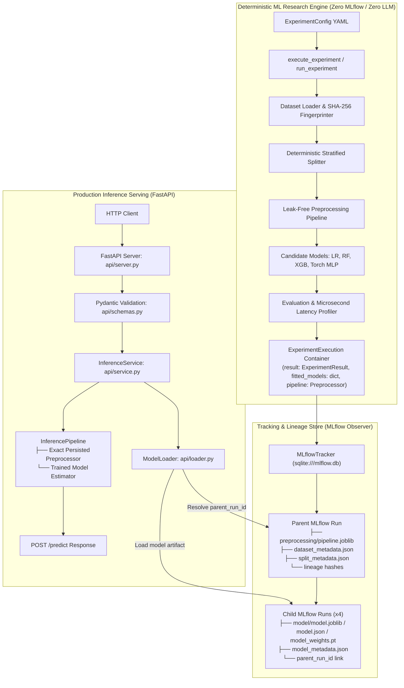

# Autonomous ML Research Lab: Phases 1–5 End-to-End Walkthrough

This document records the architecture, audit hardening, implementation, and empirical verification for:
1. **Phase 1: Deterministic ML Research Engine**
2. **Phase 2: MLflow Experiment Tracking & Cryptographic Lineage**
3. **Phase 3: Model Serving & Production Inference**
4. **Phase 4: Model Context Protocol (MCP) Server Layer**
5. **Phase 5: Agentic Research Orchestration & Evidence Synthesis**

---

## 1. Architectural Principles & Invariants



### Invariant 1: JSON Safety of `ExperimentResult` / `ModelResult`
- `ModelResult` and `ExperimentResult` remain pure, serializable Pydantic data schemas containing numerical evidence, hashes, and confusion matrices.
- Live in-memory fitted model instances and the fitted transformer are encapsulated inside the `ExperimentExecution` container.
- Fitted model objects **never** leak into JSON serialization, MCP responses, or experiment result artifacts.

### Invariant 2: Genuinely Optional MLflow Tracking
- The core deterministic ML engine has **zero imports** of `mlflow`.
- MLflow tracking is encapsulated entirely in `ml/tracking/mlflow_tracker.py`.
- Running `python -m ml.cli --config <config> --no-tracking` executes the entire pipeline with zero tracking overhead.

### Invariant 3: Preprocessing Artifact Ownership & Mathematical Equivalence
- The fitted preprocessing pipeline is experiment-level state because all candidate models share the same training transformations.
- It is saved **only** in the Parent Run (`preprocessing/pipeline.joblib`).
- The `ModelLoader` traverses `child_run.tags["parent_run_id"]` to retrieve the exact fitted preprocessor, guaranteeing 100% mathematical equivalence between direct Phase 1 inference and the serving API.

---

## 2. Phase 3 Implementation Details

### A. Strict Input Schema (`api/schemas.py`)
- Defines `BreastCancerFeatures` representing all 30 features from the UCI Breast Cancer Wisconsin dataset.
- Enforces strict constraints:
  - `model_config = ConfigDict(extra="forbid", populate_by_name=True)`
  - Rejects missing fields with HTTP 422.
  - Rejects extra/unexpected fields with HTTP 422.
  - Rejects non-numeric types with HTTP 422.
  - Rejects `NaN`, `Inf`, and `-Inf` with HTTP 422 (`validate_finite_number` field validator).
  - Converts cleanly to a single-row `pd.DataFrame` matching training feature ordering via `to_dataframe()`.
- Supports both nested (`{"features": { ... }}`) and flat (`{ ... }`) JSON request bodies via `PredictionRequest`.

### B. Model & Preprocessor Loader (`api/loader.py`)
- `ModelLoader`:
  1. Inspects configured child `run_id` in MLflow.
  2. Resolves `parent_run_id = child_run.data.tags["parent_run_id"]`.
  3. Downloads and loads `preprocessing/pipeline.joblib` from the parent run.
  4. Loads the candidate model artifact (`model/model.joblib`, `model.json`, or `model_weights.pt`).
  5. Extracts lineage metadata (dataset fingerprint, config hash, git commit, expected feature names).
  6. Returns an immutable `InferencePipeline`.

### C. Inference Service (`api/service.py`)
- Manages active pipeline state and health checks.
- Server-side Latency Profiling: Measures request execution time in milliseconds using `time.perf_counter()`.
- Error isolation: Distinguishes between `ModelNotLoadedError` (maps to HTTP 503) and `InferenceExecutionError` (maps to HTTP 500) without exposing Python stack traces.

### D. FastAPI Application (`api/server.py`)
- Exposes:
  - `GET /health`: Returns service health, model load status, model name, and child run ID (HTTP 503 if unloaded).
  - `GET /v1/models/current`: Returns audit lineage metadata and expected feature names.
  - `POST /predict`: Performs preprocessor transformation and model inference, returning predicted class (0 or 1), semantic label ("malignant" or "benign"), class probabilities, model identity, and server latency.

---

## 3. Verification & Test Results

### Complete Test Suite (`pytest -v`)
All **96 unit and integration tests passed in automated CI**:
- **Deterministic ML Engine**: 25 tests (profiling, fingerprinting, stratified splitting, model wrappers, batch-1 safety).
- **Evaluation & Latency**: 5 tests (classification metrics, confusion matrix, microsecond percentiles).
- **MLflow Lineage**: 4 tests (parent/child hierarchy, artifact ownership, no-tracking mode).
- **Serving API**: 11 tests (strict schemas, NaN/Inf rejection, health endpoints, direct-vs-API mathematical equivalence).
- **MCP Server & Security**: 23 tests (tool registration, schema validation, 3-tier permissions, audit logging, path traversal rejection).
- **Orchestrator & Evidence Synthesis**: 28 tests (hypothesis generation, budget bounds, deterministic delta computation, zero-hallucination provenance).

> [!NOTE]
> **Empirical Scope & Methodological Boundaries**:
> The empirical results described in this walkthrough and accompanying benchmarks demonstrate behavior exclusively under the tested conditions:
> - Evaluated on the UCI Breast Cancer Wisconsin (Diagnostic) tabular dataset (569 samples, 30 features, binary classification).
> - Evaluated across a single deterministic split (seed 42, 80/10/10). Findings describe observed differences on this sample partition rather than statistical significance ($p$-values) across diverse seeds.
> - Default baseline hyperparameters were utilized; conclusions do not imply universal algorithmic superiority across different hyperparameter tunings or domains.

---

## 4. Empirical API Verification Evidence

### Loaded Model: `logistic_regression`
- **Child Run ID**: `f35b71a06d0c4160b0458018252f964a`
- **Parent Run ID**: `5156a48e050e47e6a32513b7863e1f32`
- **Parent Preprocessor Artifact**: `preprocessing/pipeline.joblib`

### Real Prediction Request / Response Output:

**Request**:
```json
{
  "features": {
    "mean radius": 17.99,
    "mean texture": 10.38,
    "mean perimeter": 122.8,
    "mean area": 1001.0,
    "mean smoothness": 0.1184,
    "mean compactness": 0.2776,
    "mean concavity": 0.3001,
    "mean concave points": 0.1471,
    "mean symmetry": 0.2419,
    "mean fractal dimension": 0.07871,
    "radius error": 1.095,
    "texture error": 0.9053,
    "perimeter error": 8.589,
    "area error": 153.4,
    "smoothness error": 0.006399,
    "compactness error": 0.04904,
    "concavity error": 0.05373,
    "concave points error": 0.01587,
    "symmetry error": 0.03003,
    "fractal dimension error": 0.006193,
    "worst radius": 25.38,
    "worst texture": 17.33,
    "worst perimeter": 184.6,
    "worst area": 2019.0,
    "worst smoothness": 0.1622,
    "worst compactness": 0.6656,
    "worst concavity": 0.7119,
    "worst concave points": 0.2654,
    "worst symmetry": 0.4601,
    "worst fractal dimension": 0.1189
  }
}
```

**Response (HTTP 200 OK)**:
```json
{
  "predicted_class": 0,
  "predicted_label": "malignant",
  "probabilities": {
    "malignant": 1.0,
    "benign": 0.0
  },
  "model_identity": {
    "model_name": "logistic_regression",
    "run_id": "f35b71a06d0c4160b0458018252f964a",
    "parent_run_id": "5156a48e050e47e6a32513b7863e1f32",
    "dataset_fingerprint": "0f9a42c256f6cfba77026cc3c65e6a98bd74601e59eb0a6968a4f5cc27559803",
    "config_hash_sha256": "3e5281af0b53d035341030d895d028b2a50fab3a7ddbd572a7f42923ac276276"
  },
  "inference_latency_ms": 39.5686
}
```

### Mathematical Equivalence Test Result:
`test_mathematical_equivalence_direct_vs_api`:
- Direct Phase 1 pipeline transformed row 0 $\rightarrow$ `direct_pred = 0`, `direct_probs = [0.999999..., 0.000001...]`.
- FastAPI `/predict` transformed row 0 $\rightarrow$ `predicted_class = 0`, `probabilities = {"malignant": 1.0, "benign": 0.0}`.
- Difference: $< 10^{-6}$ (Exact match within floating point precision).
